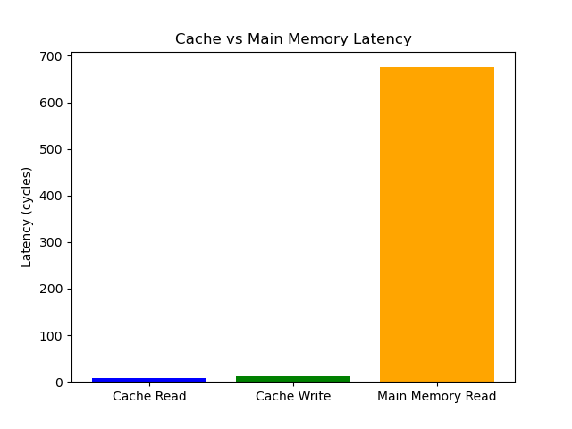
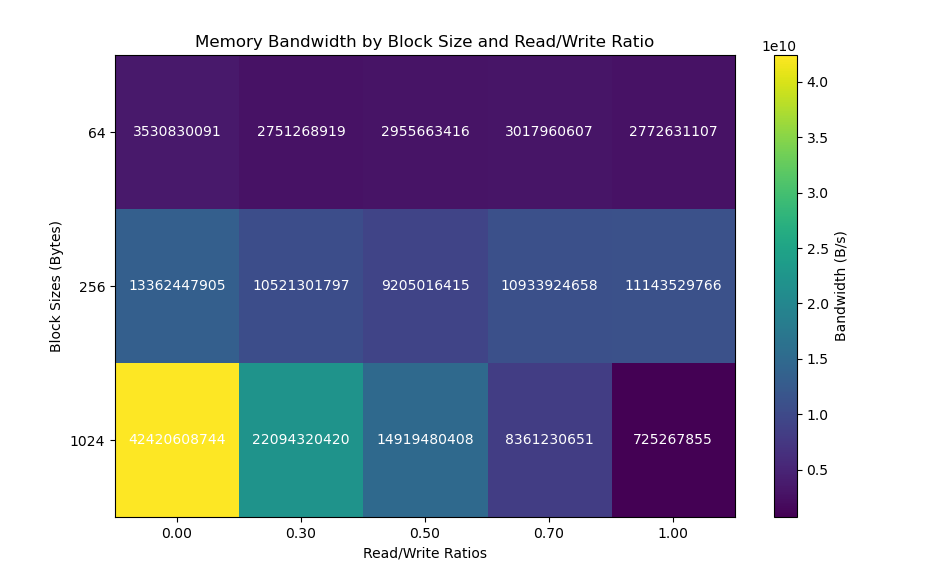
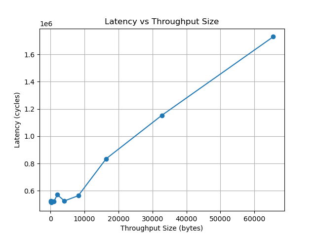
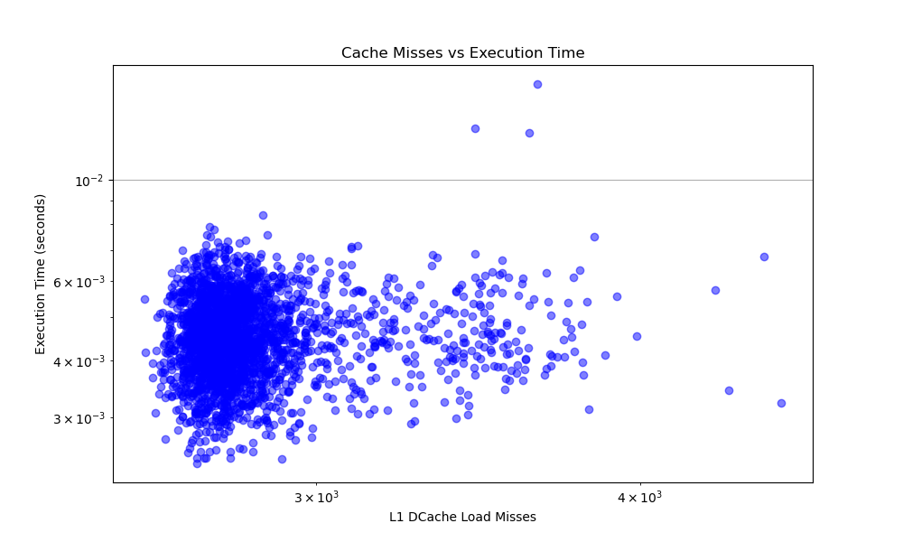
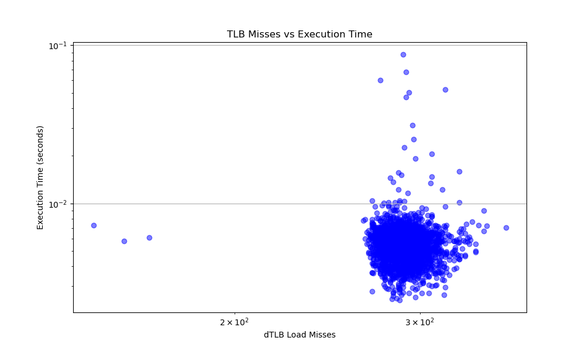

# Cache-MemoryPerformanceProfiling
The repository includes detailed experimental setup, code implementations, data analysis, and visualization of results. This project aims to provide valuable insights into the performance characteristics of modern computer systems and the factors that influence memory access efficiency.

## Dependencies
- **perf**: for collecting data on system performance to reflect an approximation of real-time behavior
- **Python**: for parsing and plotting data
  - matplotlib
  - pip
  - pandas

## Experiment 1: Zero Queuing Delay
To run this experiment, execute: `./test --part1`

  

## Experiment 2: Maximum Bandwidth
To run this experiment, execute: `./test --part2`

  

## Experiment 3: Latency Trade-off
To run this experiment, execute: `./test --part3`

  

## Experiment 4: Cache Miss Ratio Performance
To run this experiment, execute: `./test --part4`

  

## Experiment 5: TLB Miss Ratio Performance
To run this experiment, execute: `./test --part5`

  

