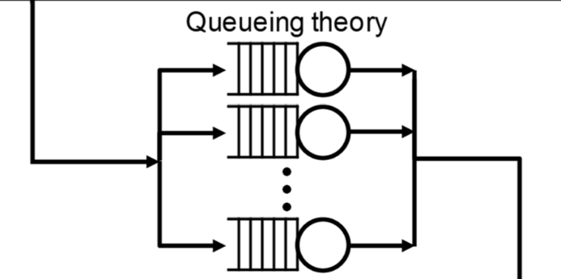

# Cache-MemoryPerformanceProfiling
This repository includes detailed experimental setups, code implementations, data analysis, and visualization of results. This project aims to provide valuable insights into the performance characteristics of modern computer systems and the factors that influence memory access efficiency.

## Table of Contents
1. [Dependencies](#dependencies)
2. [Experiments Overview](#experiments-overview)
   - [Experiment 1: Zero Queuing Delay](#experiment-1-zero-queuing-delay)
   - [Experiment 2: Maximum Bandwidth](#experiment-2-maximum-bandwidth)
   - [Experiment 3: Latency Trade-off](#experiment-3-latency-trade-off)
   - [Experiment 4: Cache Miss Ratio Performance](#experiment-4-cache-miss-ratio-performance)
   - [Experiment 5: TLB Miss Ratio Performance](#experiment-5-tlb-miss-ratio-performance)

## Dependencies
- **perf**: For collecting system performance data to approximate real-time behavior.
- **Python**: For parsing and plotting data.
  - `matplotlib`
  - `pandas`

## Experiments Overview

## Experiment 1: Zero Queuing Delay
To run this experiment, execute: `./test --part1`
This will generate a graph that will look like:

  

### Graph Explanation
The graph displays the read and write latencies for cache and main memory when the queue length is zero (i.e., zero queuing delay). There are three vertical bars representing different latency measurements in cycles:

- **Cache Read**: The latency for cache read operations is very low, indicating extremely fast data retrieval.
  
- **Cache Write**: The latency for cache write operations is also very low, slightly higher than the cache read latency, showing that writing data to the cache is nearly as fast as reading it.
  
- **Main Memory Read**: The latency for main memory read operations is significantly higher, highlighting the speed difference between accessing data from cache versus main memory.

### Key Takeaways
- **Cache Efficiency**: Low read and write latencies demonstrate cache efficiency in providing quick access to frequently used data.
- **Main Memory Latency**: Higher main memory read latency indicates slower data access compared to the cache.
- **Performance Optimization**: Optimizing data access patterns is essential to maximize cache usage and minimize main memory access, improving overall system performance.

## Experiment 2: Maximum Bandwidth
To run this experiment, execute: `./test --part2`
This will generate a graph that will look like:

  

### Heatmap Visualization of Maximum Bandwidth
The heatmap visualizes the maximum bandwidth of the main memory under various conditions of data access granularity and read vs. write intensity ratio:

#### Axes
- **X-Axis (Read/Write Ratios)**: Represents different read vs. write intensity ratios:
  - Read-only
  - Write-only
  - 70:30 ratio (70% reads, 30% writes)
  - 50:50 ratio (50% reads, 50% writes)

- **Y-Axis (Block Sizes)**: Displays different block sizes in bytes:
  - 64B
  - 256B
  - 1024B

#### Color Coding
Each cell within the heatmap is color-coded to represent the level of bandwidth achieved:
- **Darker colors** indicate higher bandwidths.
- **Lighter colors** represent lower bandwidths.

#### Numerical Values
Numerical values within each cell specify the exact bandwidth measurement in bytes per second (B/s).

#### Interpretation
- **Read-Only vs. Write-Only**: Compare bandwidth for read-only and write-only operations across different block sizes.
- **Mixed Ratios**: Observe how bandwidth changes with mixed read/write operations (70:30 and 50:50 ratios).
- **Block Size Impact**: Compare how block size affects maximum bandwidth for each read/write ratio.

#### Key Observations
- **Higher Bandwidth for Larger Blocks**: Generally, larger block sizes (e.g., 1024B) achieve higher bandwidths compared to smaller block sizes (e.g., 64B).
- **Read vs. Write**: Bandwidth varies significantly between read-only and write-only operations, with mixed ratios falling in between.
- **Optimal Configurations**: The heatmap identifies optimal configurations for achieving maximum bandwidth under different conditions.

This visualization provides a clear comparison of how memory performance can vary based on block size and operation type, allowing for quick identification of optimal configurations for desired performance outcomes.

## Experiment 3: Latency Trade-off
To run this experiment, execute: `./test --part3`
This will generate a graph that will look like:

  

### Graph Explanation
The graph titled “Latency vs Throughput Size” illustrates the trade-off between read/write latency and throughput of the main memory, demonstrating what queuing theory predicts.

#### Axes
- **X-Axis (Throughput Size)**: Represents throughput size in bytes, ranging from 0 to 60,000 bytes.
- **Y-Axis (Latency)**: Represents latency in cycles, ranging from 0 to 1.6 million cycles.

#### Line Representation
The line on the graph starts at the origin (0,0) and increases in a nonlinear fashion, becoming steeper as the throughput size increases. This indicates that as the amount of data being processed (throughput) increases, the latency also increases.

#### Queuing Theory Prediction
- **Queuing Theory**: Studies the concept of a "waiting structure" or queues, predicting that as more tasks are queued for processing by the memory (higher throughput), each individual task will experience longer delays (higher latency).
- **Trade-Off**: The graph visually represents this trade-off, aligning with queuing theory’s predictions about system performance under different load conditions.

  

#### Key Takeaways
- **Higher Throughput, Higher Latency**: As throughput size increases, latency increases nonlinearly, indicating that the system becomes less efficient at handling larger amounts of data.
- **Performance Optimization**: Understanding this trade-off is crucial for optimizing system performance, highlighting the importance of balancing throughput and latency.

## Experiment 4: Cache Miss Ratio Performance
To run this experiment, execute: `./test --part4`
This will generate a graph that will look like:

  

The scatter plot shows the relationship between L1 DCache Load Misses and Execution Time (seconds). Here’s a breakdown of what it represents:

- **Horizontal Axis (X-axis)**: L1 DCache Load Misses, ranging from 0 to 5000.
- **Vertical Axis (Y-axis)**: Execution Time on a logarithmic scale, ranging from 10-2 to 102 seconds.

### Key Observations
- **Dense Cluster**: A dense cluster of data points at the lower end of both axes indicates that most executions have fewer cache misses and shorter execution times.
- **Scattered Points**: As the number of cache misses increases, execution time tends to increase, but the data points become more scattered and less dense.

### Interpretation
- **Lower Cache Misses**: Generally correlate with shorter execution times.
- **Higher Cache Misses**: Tend to result in longer execution times, but with more variability.

This graph demonstrates how cache performance impacts execution time in a computer system.

## Experiment 5: TLB Miss Ratio Performance
To run this experiment, execute: `./test --part5`
This will generate a graph that will look like:

  

- **Horizontal Axis (X-axis)**: dTLB Load Misses, ranging from approximately 200 to 500.
- **Vertical Axis (Y-axis)**: Execution Time on a logarithmic scale, ranging from 10-2 to 10-1 seconds.

### Key Observations
- **Dense Cluster**: Most data points are densely clustered around the lower range of both dTLB Load Misses and execution time, indicating that many executions have fewer TLB misses and shorter execution times.
- **Upward Trend**: As the number of dTLB Load Misses increases, there is a slight upward trend in execution time, suggesting that higher TLB misses might correlate with longer execution times.

### Interpretation
- **Lower TLB Misses**: Generally correlate with shorter execution times.
- **Higher TLB Misses**: Tend to result in longer execution times, but with more variability.

This graph illustrates how TLB performance impacts execution time in a computer system.
